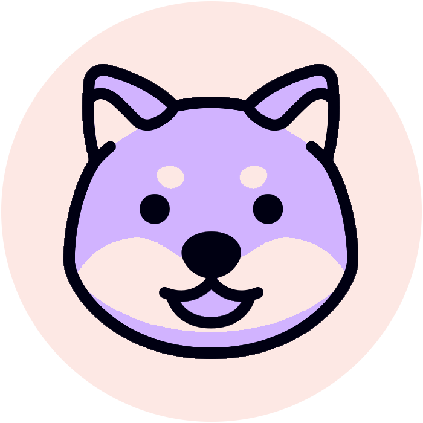

<h3>Doggui Pack</h3>

<h6>
<a href="">Github</a>
·
<a href="">Get started</a>
·
<a href="">Colors</a>
·
<a href="">Application</a>
·
<a href="">Information</a>
</h6>

<em>
<!-- Doggui offre une variété de thèmes de couleur agréables pour les yeux et adaptés à tous les usages. Communautaire et accessible à tous, Doggui permet à chacun de personnaliser son interface avec élégance. -->
Community-based and accessible to all, Doggui lets everyone personalize their interface with elegance.
</em>

#### Coming soon..